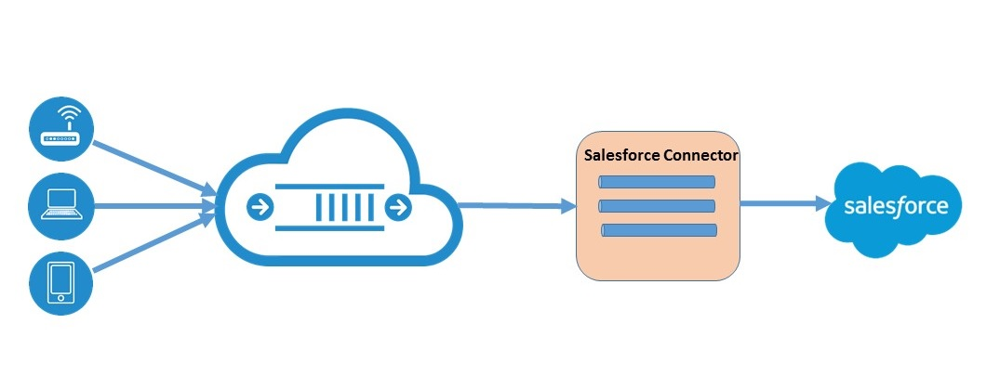
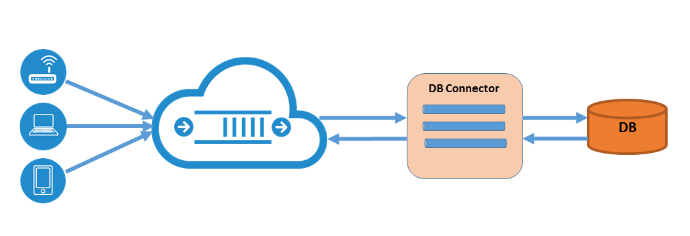

# Salesforce Connector

This section introduces you to the Salesforce Connector providing an API between your client applications/devices and Salesforce account.

The Salesforce connector currently supports **Salesforce Case Create** requests with AMQP transactions processed through the [robomq.io](http://www.robomq.io) broker.  The incoming AMQP playload consists of attributes necessary to create and assign a case (i.e. subject, description, contact name, etc.).  NOTE- additional record types may be supported in the future.

###Overview:

A Salesforce customer may have one or more users/divisions within their organization.  The connector is designed as a planned part of their business model, given they may wish to utilize an automated process to create/update case entries in Salesforce.

The Salesforce connector makes it simple for client device/applications specified by customer to automatically create cases through robomq.io.  Case fields are auto-populated in Salesforce when a device issues an alarm, defect, etc. through the broker or AMQP destination queue.  The  connector/consumer instance receives case requests, identifies the source of the incoming message, maps to a destination Salesforce user, and create a case record that will be assigned to that user account according to attributes sent in payload. 

The Connector is intended for installation/execution on the customer site/platform.  With multiple Salesforce tenants existing per organization, each is represented on the connector by a listening **"consumer"**  all listening over AMQP simultaneously for case request messages.

###Startup Authentication Process:

Before the connector can start processing any case requests, an access token must be provided by the Salesforce authentication server.

- The connector requests authorization on behalf on tenant providing username and password, then server verifies credentials and responds with access token.
- The connector obtains the access token and submits with all subsequent requests.

###Configuration:
The connector configuration is a JSON formatted file simply requiring definition of 2 sections, "tenant" and "divisions":

- Tenant section:
	- Salesforce client Id and secret for remote API access,
	- AMQP connection parameters and credentials.
- Divisions section:
	-  Salesforce user/division credentials
	-  Default case record attributes
	-  AMQP exchange, queue, and/or routing key.

###Execution:
The connector is provided as an executable script compatible with Python 2.7 and above.  Starting it simply requires passing the pre-defined configuration file as an argument as shown in example below:

	python SFconnector.py -i config.json

# DB Connector
 
This section introduces you to the DB Connector providing an API between your client applications/devices and back-end database. 

# REST Adapter

This section introduces you to the REST adapter providing an API between your client applications and publishers/subscribers connected to your AMQP virtual host. 

