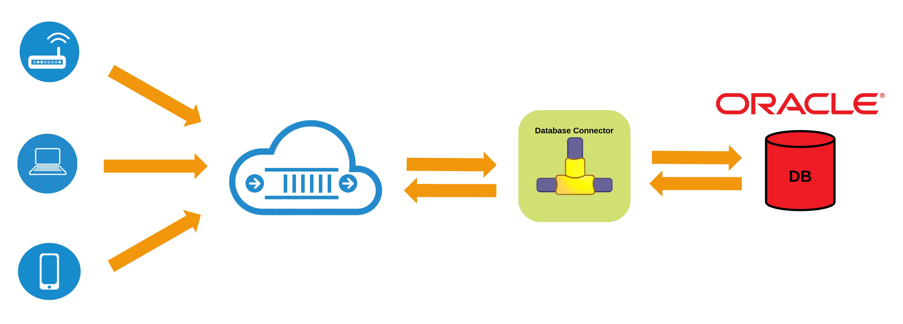

# Oracle Database Connector

As you probably already know, the Oracle Database is a Relational Database Management System (RDBMS) produced and marketed by Oracle Corporation. Oracle database is comprised of a collection of datasets or tables.

These tables are used to store and retrieve related information which is essential to building many of the business applications required to solve business problem of all types and sizes. Oracle is an integral part of software systems used by many businesses, providing persistence, retrieval and management and analysis of data. Oracle database is a common data store for many of the analytics, visualization and BI/DWH applications.

Oracle RDBMS being such an integral part of an enterprise applications, there is almost always a need for integration to it to store or to retrieve data as part of business workflows or Enterprise Application Integration (EAI) and even IoT initiatives. The good news is that integrating or connecting with Oracle database using <a href="https://www.robomq.io">RoboMQ</a> SaaS and IoT <a href="https://robomq.io/index.html#thingsconnect">integration</a> platform is a breeze!

**Fig 1: Schematic of Oracle database connector of RoboMQ**

RoboMQ is an integration middleware platform targeted at “Enterprise IoT”. It is a world where the devices, sensors, clouds, SaaS applications, mobility and enterprise applications connect together to create business workflows. RoboMQ is built on <a href="https://robomq.io/index.html#microservices">Microservices</a> and hybrid cloud architecture, allowing the applications and devices to collaborate across clouds and networks with no location restrictions.

RoboMQ’s key differentiation in the market place is it being <a href="https://robomq.io/index.html#why">protocol agnostic or API-less</a>. Devices and systems integrate using their choice of protocol or languages with no product specific APIs mandated by RoboMQ. This is achieved by “<a href="https://robomq.io/index.html#thingsconnect">ThingsConnect</a>" suite of connectors and adapters, which provides integration hooks for all IoT devices, all integration protocols, systems, database and applications.

To support relational databases systems, RoboMQ provides Database connectors for all major  databases including Oracle. You can send and receive data to and from Oracle database and make it part of any integration workflow built using RoboMQ middleware. All you need is the JDBC connectivity to your Oracle database.

What does this really mean for you? At a high level you can include databases and database driven applications easily into the integrations built using RoboMQ. You could receive messages over RoboMQ using any of MQTT, AMQP, Stomp, WebStomp or REST protocols and persist them into the database. At the same time, you can select information from the database and publish it as a message that could be consumed by clients using any of the above mentioned messaging and integration protocols. So essentially it is a full two way integration of Oracle database with RoboMQ.

Setting up the Oracle database connector is incredibly easily. All you need is to collect the Oracle database connection information and user credential and configure the RoboMQ Oracle connector.

<a href="https://robomq.io/index.html#thingsconnect">ThingsConnect</a> Oracle connector like almost anything with RoboMQ is a microservice that runs as an independent and atomic docker container. You provide the connection and the credential configuration in a config file and mount the configuration to the docker container. This is as simple as 1-2-3:

1. Obtain Oracle database information and credential
2. Put the configuration information in a config file
3. Run the connector which is a Docker container or a microservice

The Oracle database connector can be run anywhere as a docker container with the following single line command:

	$ docker run -d --name oracle_connector -v path/to/config:/opt/thingsConnect/config/x-adapter/ oracledbconnector:v1.00

Seems too simple and easy, yes it is...

The connector can be run as a docker container inside the corporate firewall or on the cloud. No firewalls are needed since it always makes outbound IP connection to RoboMQ. When you run the docker container, it pulls the image from the docker repository and runs a Docker container from it. Any future updates are automatically available to you as the updates to the Docker image itself. You do however have the option to run the connector as a standalone traditional program not using the docker technology.

There are some <a href="https://robomq.io/docs/docs.html">additional details</a> like it supports JSON as well as delimited ASCII data (CSV or any delimited text format) interchange methods. The connector also has error handling built in with the provision of the “dead letter” queues. Any messages that cannot be handled are routed to the dead letter queue. The robust error handling provided as core part of RoboMQ product provides email/SMS or phone alert and an ability to create a ticket or a case in ticketing system like ServiceNow, Jira or Salesforce. These errors or the tickets created by the connector can then be handled on a case-by-case basis by the operations or support teams. In addition to it, you get the Error Analytics component of RoboMQ which provides a strategic root cause analysis and visualization of errors in your integrations.

So what are you waiting for? Try out our Oracle Database connector and let us know your feedback. To learn more about this and many other connectors that <a href="https://www.robomq.io">RoboMQ</a> offerers check back on our connectors page! If you have any other questions please reach out to us at,<a href="mailto:sales@robomq.io">sales@robomq.io</a> and we would love to help.