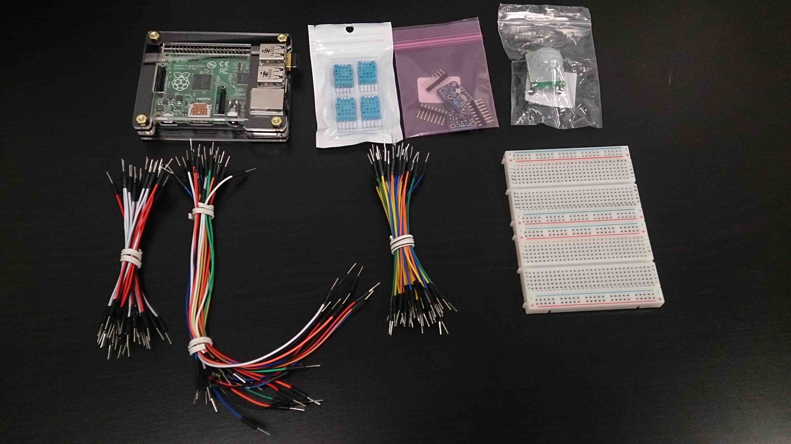
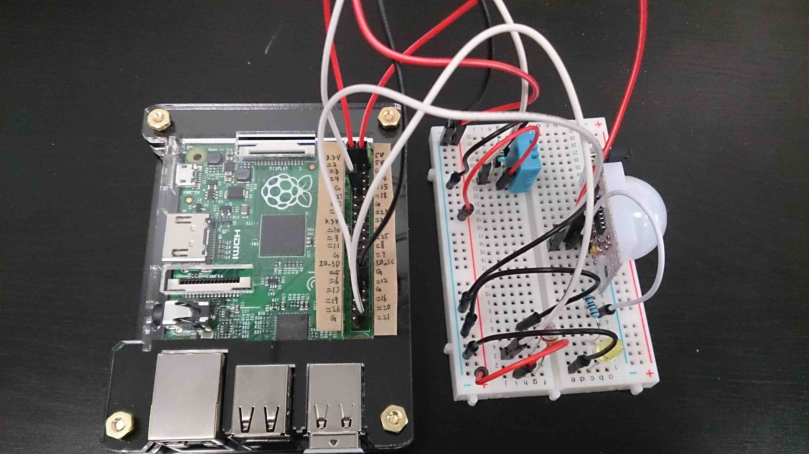
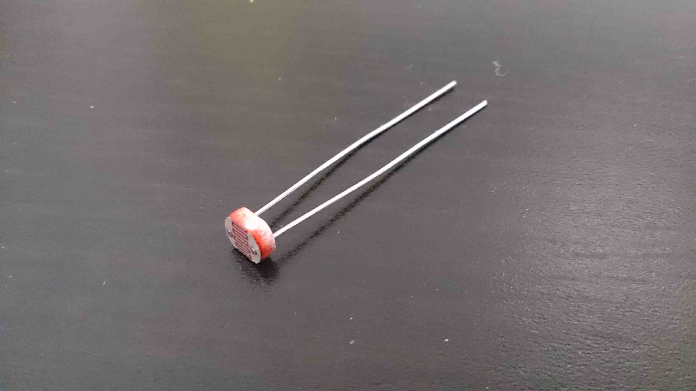
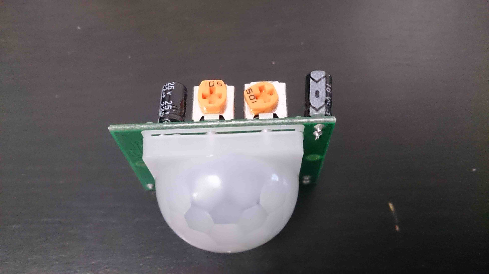

#IoT and M2M Integration

Devices, sensors and systems connecting together are driving the next generation of applications creating the Internet of Things (IoT). <a href="https://www.robomq.io" target="_blank">RoboMQ.io</a> provides an open standard based platform to connect your devices and sensors to the back-end applications, systems, processes and people to build the nest big thing. You can work with message queue protocols like MQTT ( MQ for Telemetry), AMQP (Advanced Message Queue Protocol) and STOMP ( Simple Text Oriented Messaging Protocol) while using <a href="https://www.robomq.io" target="_blank">RoboMQ.io</a>.

The protocols supported by <a href="https://www.robomq.io" target="_blank">RoboMQ.io</a> can run on very small footprint devices using a choice among languages that are supported by device OS and profile.

Common choices of devices include Raspberry Pi, Audrino, Beaglebone and mBed based platforms. The most basic requirement is the support for running one languages and network connectivity. You should however be cognizant of the device footprint when choosing the message queue protocol.

For the example case, we have chosen Raspberry Pi device running a small Linux kernel (a variant of Debian Linux) and Python programming language.

##Raspberry Pi as an example device

The Raspberry Pi is a credit-card sized micro-computer that plugs into your TV and a keyboard. It is a capable little computer which can be used in electronics projects. In this guide you will be introduced how to use raspberry pi to acquire information from real-world via sensors and other electrical components, and then integrate raspberry pi into <a href="https://www.robomq.io" target="_blank">RoboMQ.io</a> as data producer.


###Getting raspberry pi ready

There may be some steps to do when you have all the devices and materials. For example you need to install a system into the micro-SD card which your raspberry pi will be boot from.

For detailed instructions on how to setup a raspberry pi, please go to the official raspberry pi document page.

<a href="https://www.raspberrypi.org/documentation/" target="_blank">Raspberry Pi Documentation</a>

###Prerequisite

###Raspberry Pi

Although any model of raspberry pi will work, we recommend the newest version. In this documentation we will use the model raspberry pi B+ for the example. You can buy a raspberry pi from their official site:

<a href="https://www.raspberrypi.org/products/" target="_blank">raspberry products</a>

###Input device

For raspberry B+ there are 4 USB ports on the board. You can plug in a USB keyboard and mouse to control your raspberry pi.

###Power source

A typical Android cellphone charger is good for raspberry pi.

###Monitor(optional)

Raspberry Pi has an HDMI port for display. It may be easier and more comfortable for you to work with your raspberry pi directly on it's own system GUI. But if you do not, there is still no problem because you can also use you laptop to ssh the raspberry and control it in the terminal. For tutorial how to ssh a raspberry you can refer to Adafruit Learning System:

<a href="https://learn.adafruit.com/adafruits-raspberry-pi-lesson-6-using-ssh" target="_blank">https://learn.adafruit.com/adafruits-raspberry-pi-lesson-6-using-ssh</a>

###Sensors:

Raspberry pi is compatible with a lot of sensors. In our documentation we are going to show 3 sensors for demonstration: DHT11 humidity & temperature sensor, PIR motion sensor and light sensor. You can get these sensors from online shopping sites (Amazon, ebay, etc).

###Breadboard and jumper wires

These are used to connect sensors to the raspberry pi. You can also get these from online shopping sites.



###Python

This is the language we recommend for raspberry pi-sensor programming. As it's handy, simple, and is supported by raspberry pi. Python 2.7.3 or above is preferred.

###Raspberry Pi and sensors


With raspberry pi we can easily develop some sensor programs. In this part we are going to show 3 examples: PIR motion sensor, DHT11 humidity & temperature sensor, and light sensor. Before integrating these sensors into <a href="https://www.robomq.io" target="_blank">RoboMQ.io</a>, we would try them locally on your raspberry. You can see how them work in your raspberry pi LXTerminal.  

For details about how to set up and run the sensors with raspberry pi, please go to the **Adafruit Learning System**.  

###DHT11 humidity & temperature sensor


<a href="https://learn.adafruit.com/downloads/pdf/dht-humidity-sensing-on-raspberry-pi-with-gdocs-logging.pdf" target="_blank">https://learn.adafruit.com/downloads/pdf/dht-humidity-sensing-on-raspberry-pi-with-gdocs-logging.pdf</a>

###Light sensor



<a href="https://learn.adafruit.com/basic-resistor-sensor-reading-on-raspberry-pi/basic-photocell-reading" target="_blank">https://learn.adafruit.com/basic-resistor-sensor-reading-on-raspberry-pi/basic-photocell-reading</a>

###PIR motion sensor



[https://learn.adafruit.com/adafruits-raspberry-pi-lesson-12-sensing-movement/overview](https://learn.adafruit.com/adafruits-raspberry-pi-lesson-12-sensing-movement/overview "PIR motion sensor")
<a href="https://learn.adafruit.com/adafruits-raspberry-pi-lesson-12-sensing-movement/overview" target="_blank">https://learn.adafruit.com/adafruits-raspberry-pi-lesson-12-sensing-movement/overview</a>

##Integrate Raspberry Pi with robomq.io

After you have finished setting it up and testing it locally, you may start to think: Why would I do this? What can I do with this in real world? 

Okay, let's imagine a scenario. You are an employee in a water & sewer utility company. You need a system to monitor your water wells. You need temperature, humidity, luminance, and intruder detection real-time data to be read as it happens and, for some, at a defined interval. And for the convenience of management and ability to take immediate actions, you need all the data to be visible in your control center.

As an smart engineer, you have already developed the sensor data collecting programs, as discussed in sections above, by working with raspberry pi and sensors locally. What you need now is to add some simple code to send the data read from the sensors via <a href="https://www.robomq.io" target="_blank">RoboMQ.io</a> broker to <a href="https://www.robomq.io" target="_blank">RoboMQ.io</a> dashboard application so that you can easily open the dashboard and view data charts.

For sending data, the main job is to create a producer module, then call its send method in your raspberry pi sensor programs. Follow the next section to build this application. You will find it easy, handy and fun !!!  

> <a href="https://www.robomq.io" target="_blank">RoboMQ.io</a> has now enhanced and packaged the sensorProducer module introduced bellow. You may either directly use our package or build the module yourself following the next section. The Python pip package is available at <https://s3.amazonaws.com/public.robomq/packages/sensorProducer.tar.gz>. Read our blog at <http://robomq.blogspot.com/2015/05/device-to-dashboard-real-time-analytics.html> for specific use guide.  

##Messaging with AMQP

####Create Producer

First, launch your raspberry pi and create a file named "producer.py", then paste the following code into the file:

```python
import sys, os, json, pika
	
stationID = "well1"
coordinate = [-89, 64]
server = "hostname"
port = "5672"
vhost = "waterSupply"
username = "username"
password = "password"
topic = "sensors"
parameters = pika.URLParameters("amqp://" + username + ":" + password + "@" + server + ":" + port + "/" + vhost)
	
def connect():
	try:
		connection = pika.BlockingConnection(parameters)
		channel = connection.channel()
		return channel
	except:
		print "Error: Failed to connect broker"
	
channel = connect() #connect to broker
	
#publish message
def send(msgJson):
	global channel
	msgJson["stationID"] = stationID
	msgJson["coordinate"] = coordinate
	properties = pika.BasicProperties(content_type = "application/json", delivery_mode = 1)
	try:
		channel.basic_publish("amq.topic", topic, json.dumps(msgJson, ensure_ascii=False), properties)
	except:
		print "Error: Failed to send message"
		channel = connect() #reconnect to broker
```

It will be the producer module that you are going to import in your raspberry pi-sensor codes to send messages to <a href="https://www.robomq.io" target="_blank">RoboMQ.io</a>. As you can see, the producer module contains 2 methods. First is the `connect()` method that is in charge of establishing connection to the <a href="https://www.robomq.io" target="_blank">RoboMQ.io</a> broker. It will automatically reconnect on exception too. Another method is `send()` which publishes messages through <a href="https://www.robomq.io" target="_blank">RoboMQ.io</a> to worker consumers running on <a href="https://www.robomq.io" target="_blank">RoboMQ.io</a> server. (You always have the option to build your own worker consumers to handle messages sent by yourself).  
In any of your sensor programs, just call `send()` function to send the data collection to <a href="https://www.robomq.io" target="_blank">RoboMQ.io</a> broker.  A message should be a JSON object containing key-value pairs. Now we are all set for the producer module, after this we are going add a few lines in the sensor programs.

####Edit Sensor Programs

In this part we are going to combine the DHT11 sensor and the Light sensor into one program, just for clean-wise.

Edit your DHT11 sensor and Light sensor program as bellow:

```python
import RPi.GPIO as gpio
import Adafruit_DHT
import time
import os
import sys
import producer      

DEBUG = 1
gpio.setmode(gpio.BCM)

htsensor = Adafruit_DHT.DHT11
htpin = 4
lpin=21

while True:
   humidity, temperature = Adafruit_DHT.read_retry(htsensor, htpin)
   if humidity is not None and temperature is not None:
       temperature = temperature * 9 / 5 + 32
       print 'Temp={0:0.1f}*F  Humid={1:0.1f}%'.format(temperature, humidity)
   else:
       print 'Failed to get reading. Try again!'

reading = 0
gpio.setup(lpin, gpio.OUT)
gpio.output(lpin, gpio.LOW)
time.sleep(1)
gpio.setup(lpin, gpio.IN)
while (gpio.input(lpin) == gpio.LOW):
   reading += 1
luminance = 100 - reading
print ('Luminance='), luminance

message = {"time": time.time() * 1000}
message["temperature"] = temperature
message["humidity"] = humidity
message["luminance"] = luminance
try:
   producer.send(message)
except:
   print "Error: failed to send data through producer"

time.sleep(30) #interval
```

And then edit your PIR motion sensor as bellow:

```python
import RPi.GPIO as gpio
import time
import producer

gpio.setmode(gpio.BOARD)
mpin = 31
gpio.setup(mpin,gpio.IN)

while True:
   gpio.wait_for_edge(mpin, gpio.RISING)
   print('Intruder detected')
   message = {"time": time.time() * 1000}
   message["intruder"] = 1
   try:
       producer.send(message)
   except:
       print "Error: failed to send data through producer"
   gpio.remove_event_detect(mpin)
   
   gpio.wait_for_edge(mpin, gpio.FALLING)
   print('Intruder left or froze')
   message = {"time": time.time() * 1000}
   message["intruder"] = 0
   try:
       producer.send(message)
   except:
       print "Error: failed to send data through producer"
   gpio.remove_event_detect(mpin)
```

Now all your data will be sent via <a href="https://www.robomq.io" target="_blank">RoboMQ.io</a> broker to the our dashboard application. The only thing you need to accomplish is just open your dashboard in a Web browser.    

##Messaging with MQTT

In the example above we implemented sending message by creating a producer module in AMQP protocol and call its `send()` function in the sensor program. However there are more than one way we can build a producer as <a href="https://www.robomq.io" target="_blank">RoboMQ.io</a> supports multiple protocols. Now we are going to show you one more example how to send messages using the MQTT protocol.

You only need to change the producer module. Modify the "producer.py" as bellow:

```python
import sys, os, json
import paho.mqtt.client as mqtt
	
stationID = "well1"
coordinate = [-89, 64]
server = "hostname"
port = 1883
vhost = "waterSupply"
username = "username"
password = "password"
topic = "sensors"
	
def connect():
	try:
		client = mqtt.Client(client_id="", clean_session=True, userdata=None, protocol="MQTTv31")
		client.username_pw_set(vhost + ":" + username, password)
		client.connect(server, port, keepalive=60, bind_address="")
		client.loop_start() #start network loop
		return client
	except:
		print "Error: Failed to connect broker"
	
def reconnect():
	global client
	if (client):
		client.loop_stop() #stop the current loop before reconnecting
		client.disconnect()
	client = connect()
	
client = connect() #connect to broker
	
#publish message
def send(msgJson):
	global client
	msgJson["stationID"] = stationID
	msgJson["coordinate"] = coordinate
	try:
		result = client.publish(topic, payload=str(json.dumps(msgJson, ensure_ascii=False)), qos=1, retain=False)
		if (result[0] == 4):
			reconnect() #reconnect to broker
	except:
		print "Error: Failed to send message"
		reconnect() #reconnect to broker
```

Since the difference is limited in the producer module, there is no need to modify the sensor programs.

##Messaging with STOMP

For STOMP producer module, no change is required for sensor programs either, only change your "producer.py" as bellow:

```python
import sys, os, json
from stompest.config import StompConfig
from stompest.sync import Stomp
	
stationID = "well1"
coordinate = [-89, 64]
server = "hostname"
port = "61613"
vhost = "waterSupply"
username = "username"
password = "password"
topic = "sensors"
	
def connect():
	try:
		client = Stomp(StompConfig("tcp://" + server + ":" + port, login = username, passcode = password, version = "1.2"))
		client.connect(host = vhost)
		return client
	except:
		print "Error: Failed to connect broker"
	
client = connect() #connect to broker
	
#publish message
def send(msgJson):
	global client
	msgJson["stationID"] = stationID
	msgJson["coordinate"] = coordinate
	try:
		client.send("/topic/" + topic, json.dumps(msgJson, ensure_ascii=False), {"content-type": "application/json"})
	except:
		print "Error: Failed to send message"
		client = connect() #reconnect to broker
```


