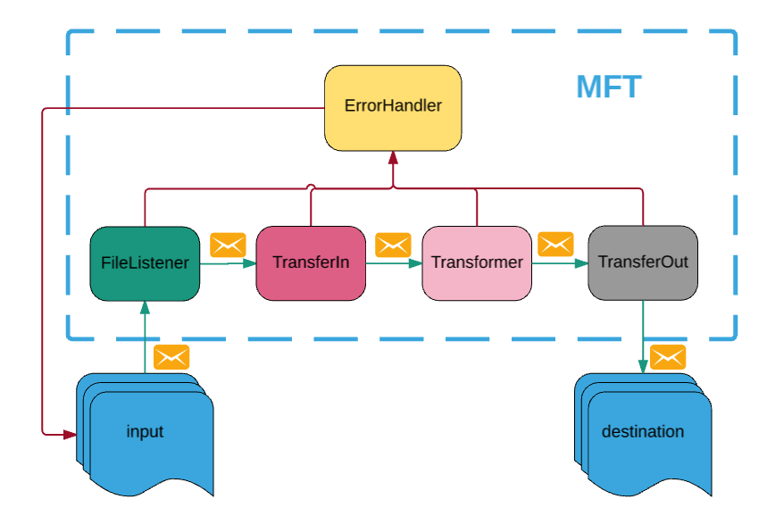
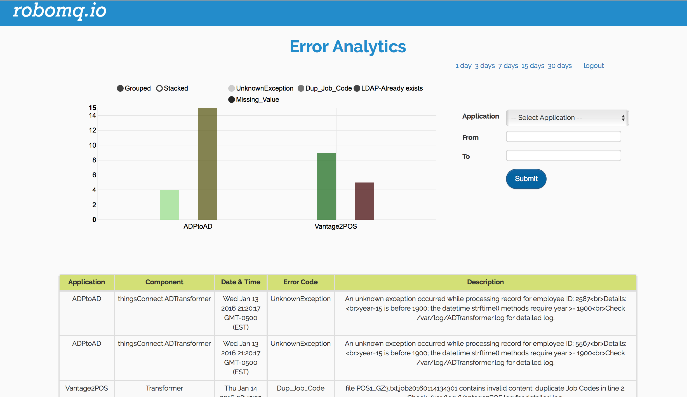

# Managed File Transfer


Managed File Transfer (MFT) is a reliable and guaranteed delivery file transfer service with all the management, error handling and recovery features built in for a secure and encrypted file transfer. It supports managed file transfer across any of the file transfer protocols (be it FTP, SFTP, FTP over SSL etc..) and various file systems (Windows, Linux/Unix, mid range systems, S3, Object Stores, Cloud Storage etc.). The file transfer is secure and encrypted and tracked through the transfer and in-transit processing providing a reliable enterprise grade MFT platform for managing the secure transfer of data from source location to one or more destinations through public, private and hybrid network.

* [Introduction](#introduction)
* [Setup and configuration](#setup-and-configuration)
* [Work Flow](#work-flow)
* [Error Handling, alerts and monitoring](#error-handling,-alerts-and-monitoring)


## Introduction

RoboMQ MFT service allows you to transfer files between file systems using variety of file transfer protocols. The Managed File Transfer platform is built on the strength of RoboMQ Message Oriented Middleware(MOM)providing guarantee delivery reliable data transfer. It utilizes the [RoboMQ](http://www.robomq.io) broker for receiving and tracking events identifying each steps of transfer and in-transit transformation.

In addition to regular MFT functionality, you get following silent advantages while using RoboMQ.

1. Support for all [file transfer protocols](http://robomq.io/index.html#thingsconnect)
2. End to end tracking for the file transfers and transformations
3. Ability to break files into messages and integrating the data with APIa. This approach offers integration with non-file based APIs and systems
4. [Microservices](http://robomq.io/index.html#microservices) based approach for data transformation, enrichments and validation
5. Robust error handling, monitoring, alerts and [Error Analytics](http://robomq.io/index.html#overview)

## Setup and configuration

The MFT service needs to talk to your [RoboMQ](http://www.robomq.io) tenant, therefore you will need to provide your `vhost or tenant ID`, `username`, `password` and your preference for secure transfer over`ssl`.

To transfer files from one location to another, MFT service requires access to four folders, let's call them `upload`, `inbound`, `outbound` and `destination` (you can use any name you want):


```
├── destination
│   ├── archive
│   └── error
├── inbound
│   ├── archive
│   └── error
├── outbound
│   ├── archive
│   └── error
└── upload
    ├── archive
    └── error
```

Those folders don't need to be under the same directory. Actually they can and often do reside on different servers, file systems or S3 `buckets`.

>Note that you will need to provide credential of the accounts for accessing those file systems and make sure those accounts have read and write permissions on the above specific folders.

In case that you need some files under those folders but don't want them to be transferred, you can configure a filter to ignore files with names that match a certain pattern.

At this point, the MFT service configured and is ready to work.

## Work Flow

The following picture depicts a typical MFT file transfer flow.


**Fig 1: High level schematic of a file transfer flow**

MFT has a file listener, it scans the `upload` folder on a configurable interval. Once a expected file detected, it will be copied to one or more `inbound` folders (multiple MFT services can work together in case the file needs to be duplicated and processed at multiple destinations).

If file requires specific validation or transformation, an optional MFT Microservice can perform transformation, validation or data enrichment on the file in the `inbound` folder. After successfully processing the file, this component moves file to `outbound` folder.

Finally another MFT Microservice will pick it up from `outbound` folder and put it into `destination`.

>Note that just like with any integration with RoboMQ there could be a whole chain of Microservices performing variety of functions including transformation, validation, data enrichment or application of any business logic while file is in transit from source to the destination.

At each step of the processing, the original successfully processed files are archived in corresponding `archive` folder.

## <a name="error-handling-alerts-and-monitoring">Error Handling, alerts and monitoring</a>
Upon any failure at any point, the current file will be moved to corresponding `error` folder. At this point RoboMQ error handling process kicks in which is robust and has multiple options for tactical as well as strategic handling of error case.

* An error message (includes file information) will be sent to an `error` queue and an notification message (describes what is the error and how it happened) will be sent to an `notification` queue.
* A SMS, an email or a phone call could be triggered to the operations team or the responsible party based on setup of the severity rules and notification mechanism
* A ticket or a case can be created in any of the case management platform being used like serviceNow, Jira, Salesforce or any other
* All the errors are saved into a real-time database which provides a analytical dashboard view of the errors for long term trends, root cause analysis and corrective actions



**Fig 1: Error Analytics dashboard for analysis and corrective actions**
